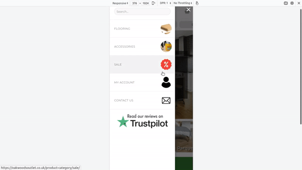

# ETS Layered Menu

Contributors: geek92sunny  
Tags: menu, flatsome, menu image, mobile, mobile menu  
Requires at least: 4.7  
Tested up to: 5.8  
Requires PHP: 7.0  
License: GPLv2    
License URI: http://www.gnu.org/licenses/gpl   

This plugin adds the option to upload image to each menu item in the admin menu editor of WordPress, on the frontend, these images are displayed on menu items in **mobile device** screen sizes. It also adds the right to left sliding effect on child menu items.
It has been only tested on **Flatsome** theme.

	

